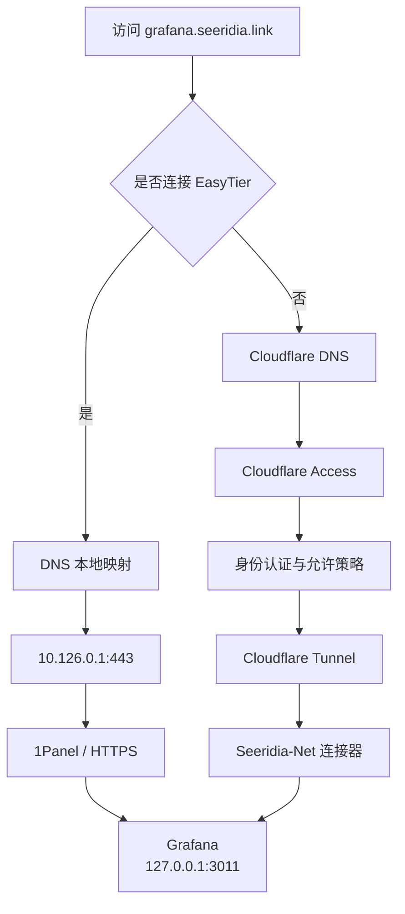
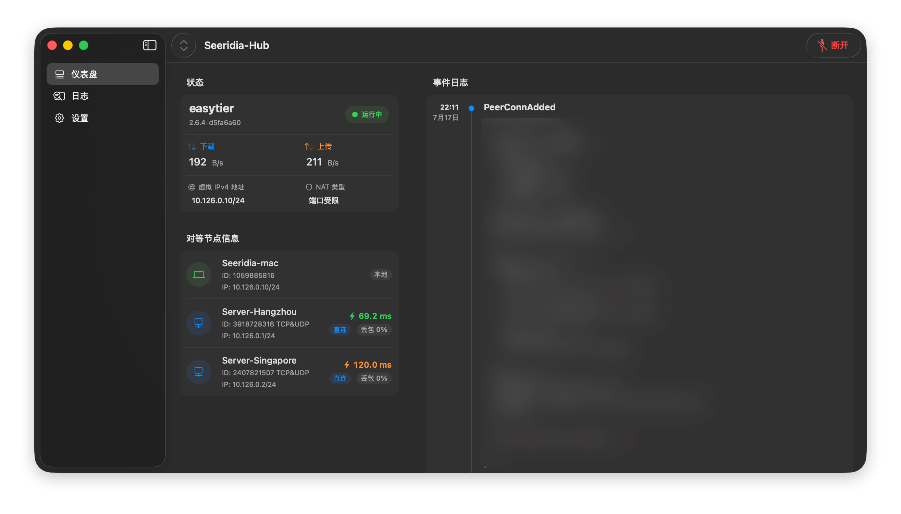
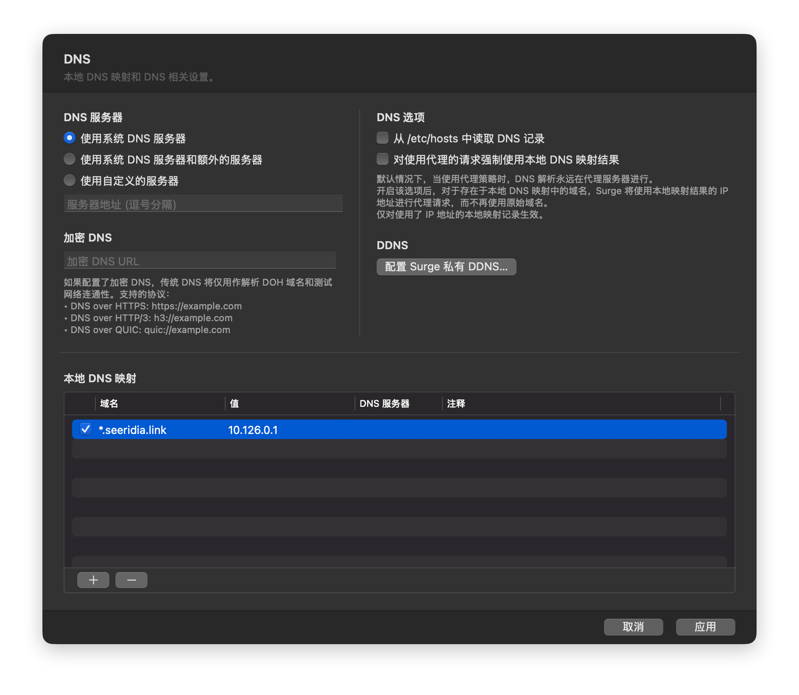
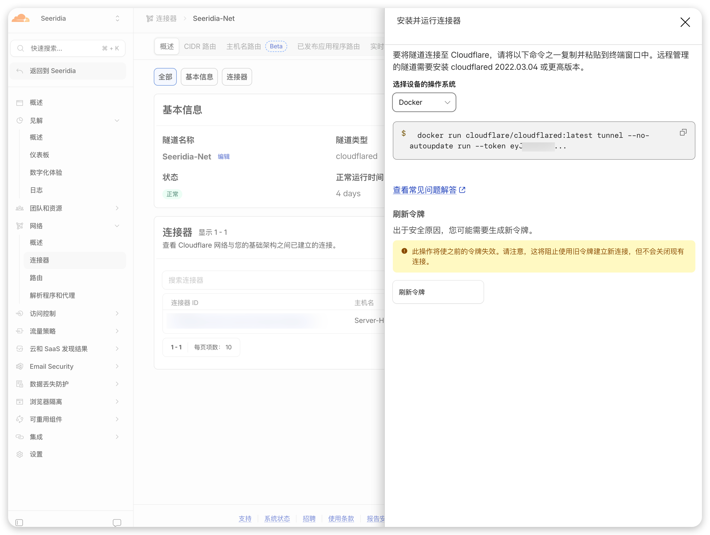
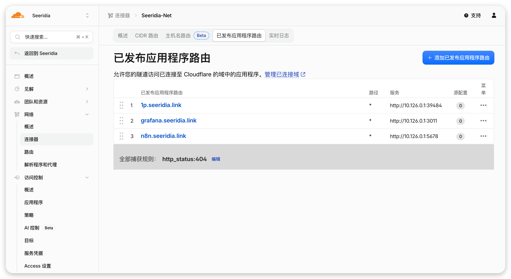
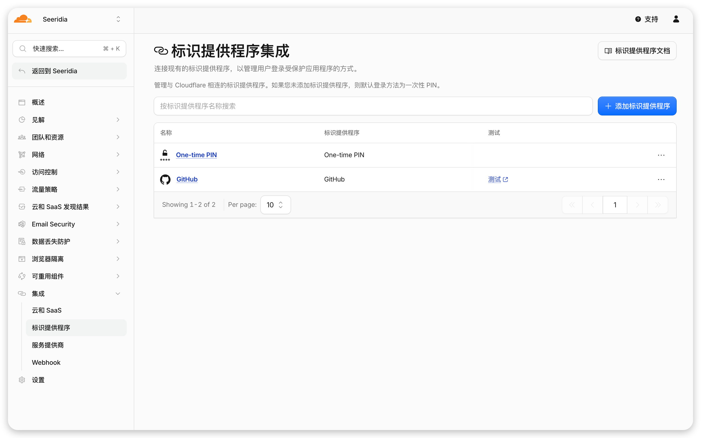
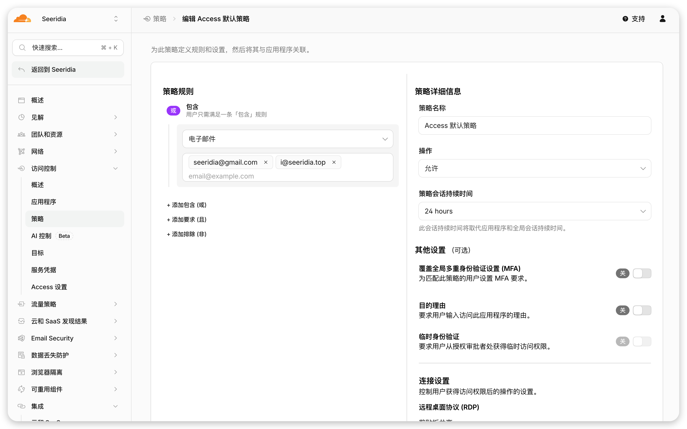
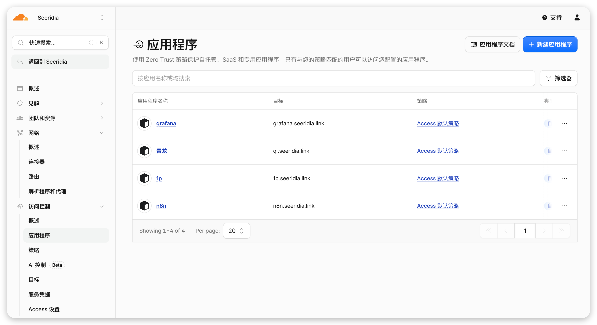
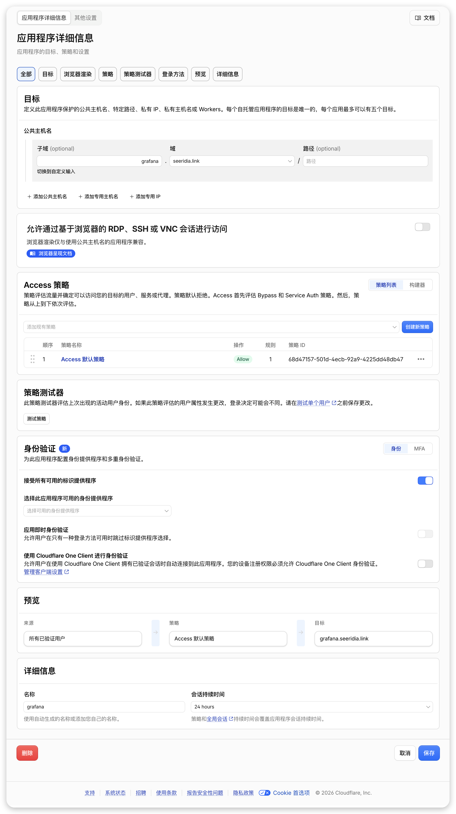

自用的自托管服务越来越多，像是 grafana、n8n 等等各种的管理面板，那如何在保证安全性的同时，提高自己的使用体验？


这些服务通常只需要我本人访问，并不适合直接暴露在互联网上。但完全限制在家庭局域网或者 VPN 内，又会在临时设备、公司电脑或无法接入 VPN 的环境中带来不便。


所以我将需求确定：

1. 在接入 VPN 后，访问流量直接通过虚拟内网到达服务器；
2. 在未接入 VPN 时，经过一层登录鉴权后访问。如果可以，这边能较为自由的控制用户策略，比如临时给他人授权。

由此我也确定了采用了由 Easytier 和 Cloudflare 构成的混合方案：

1. 连接 EasyTier 时，访问流量直接通过虚拟内网到达服务器，不经过 Cloudflare；
2. 未连接 EasyTier 时，使用同一个域名访问，先经过 Cloudflare Access 登录鉴权，再通过 Tunnel 回源。

---


## 架构设计





使用者不需要关心当前走的是哪条路径，只需要始终打开：


```javascript
https://grafana.seeridia.link
```


域名的解析结果决定了后续流量是通过 EasyTier 直达服务器，还是进入 Cloudflare 的身份认证流程。


## 用户端 - Easytier 侧


[EasyTier](https://github.com/EasyTier/EasyTier) 负责建立设备和服务器之间的加密虚拟网络，类似于常见的 Tailscale 等 VPN，这些都可以的，其实都差不了太多，不过 Easytier 往往拥有更为激进的策略，这边不展开讲其相关配置。





其实有了 Easytier 我们就可以直接通过内网去访问相关的服务而无需打开相关端口的安全组等等，到这一步就能满足大多数人的需求了，不过我们的最终目标还需要比如访问 [grafana.seeridia.link](http://grafana.seeridia.link/) 能根据我们自身环境，后续流量是通过 EasyTier 直达服务器，还是进入 Cloudflare 的身份认证流程。


在用户侧，我们要解决的是对这个 [seeridia.link](http://grafana.seeridia.link/) 域名我们应进行 DNS 映射，相关域名直接解析到 EasyTier 地址，我们可以有多种方式去配置 DNS，比如 macOS 可以通过 **`/etc/resolver`** 实现“不同域名走不同 DNS”


[bookmark](https://support.apple.com/zh-cn/guide/mac-help/mh14127/mac)


不过我自己有 Surge，就也直接使用 Surge 了





## **Cloudflare One**


我都以自己的`seeridia.link` 为例，首先需要将域名托管在 Cloudflare。我们要做的是：当设备不使用 Surge 的本地 DNS 映射时，`grafana.seeridia.link` 会按照 Cloudflare 公网 DNS 的配置进入 Cloudflare 网络。


### Cloudflare Tunnel


Cloudflare Tunnel 是用以将服务器接入 Cloudflare


在 Cloudflare Tunnel 中创建了一个名为 `Seeridia-Net` 的隧道，将服务器接入该隧道，该步骤按照 Cloudflare 的指引即可





接着可以编辑「已发布应用程序路由」


这边放上需要接入 Cloudflare Access 的全部服务





这边不需要再配置 DNS，Cloudflare 会自动帮你配好


### 标识提供程序


集成→标识提供程序


用于配置提供访问网站的登录方式，这边的 One-time PIN 即发邮箱验证码，是默认免费提供的。当然你可以自己配置 Github、Google 等等的登录方式





### 访问策略


访问控制→策略


用于配置哪些用户可以访问我们的服务，并且也可以配置多个不同的访问策略面向不同的服务。这边主要就是验证上一步回调或验证的邮箱。





### 应用程序


访问控制→应用程序


这边主要是将应用程序，即在刚刚配置 Tunnel 那边的应用程序加入 Cloudflare One








## 服务器反代


正常部署反代即可。


我自己用的是可视化面板的 1Panel，其他的也都差不多。


---


## 总结


这套架构的核心并不是简单地把两个组网工具叠在一起，而是为同一个服务设计两种不同的访问方式：

- 对已经加入可信内网的设备，提供直接、低依赖的 EasyTier 访问路径；
- 对没有加入内网的设备，提供由 Cloudflare Access 保护的浏览器访问路径。

对我来说，这套方案的价值在于：它既没有要求所有临时设备都安装 VPN，也没有为了方便而直接把私人服务暴露到公网；同时，当设备已经位于自己的 EasyTier 网络中时，又不需要让访问流量无意义地绕行 Cloudflare。

