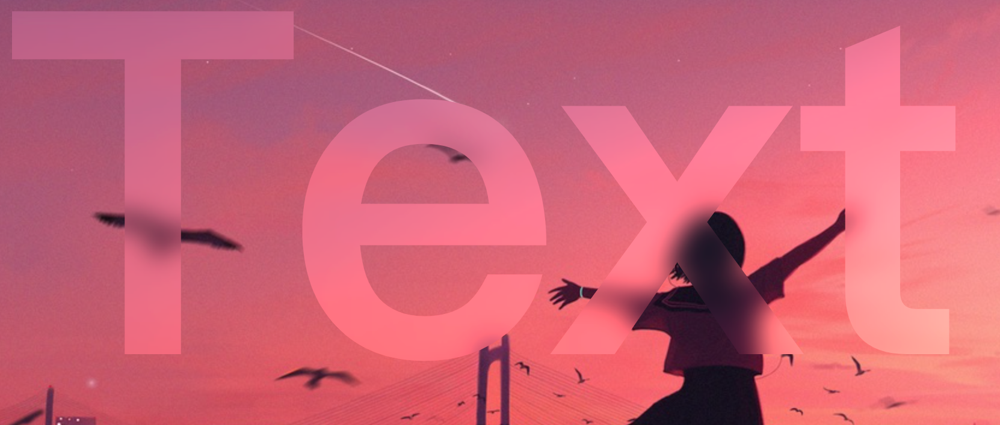

import { Spoiler } from 'astro-pure/user'

主要矛盾很早就开始了，我想给文字本身的颜色实现类似于 `backdrop-filter` 的毛玻璃效果，但这个效果在文字上并不能直接使用。（可恶）

后续也问了蛮多认识的佬，大多都是改变透明度、混色方式等等去实现貌似是这样的效果，但都不是我想要的。

最终想起了 stackoverflow ，还提了一个问题 <Spoiler>（虽然最后被指出是问题重复，有人已经提过了，但是根本搜不到好不好 QwQ）</Spoiler>

这边先贴个链接：

- [StackOverflow 讨论链接](https://stackoverflow.com/questions/60141217/applying-a-backdrop-filter-blur-to-an-svg-path)

也先贴上解决方案：（在 stackoverflow 的基础上进行了改进）

```html


<svg height="0" width="0">
    <defs>
        <clipPath id="svgTextPath">
            <text x="50" y="200" textLength="400px" font-family="Vollkorn" font-size="200px" font-weight="700"> Text </text>
        </clipPath>
    </defs>
</svg>
```

```css
body {
  margin 10px;
}

.clipped {
  position: absolute;
  top: 10px;
  left: 10px;
  clip-path: url(#svgTextPath);
  filter: blur(10px) brightness(1.2); // 调节模糊和亮度
}
```



是不是，超级无敌好的效果！

---

本帖就先这样放着，后续我可能会继续完善这个效果。
