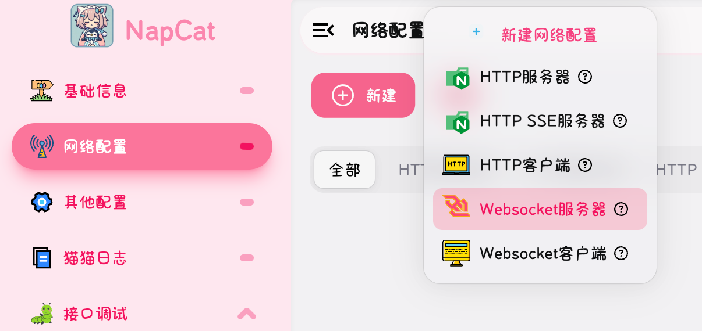
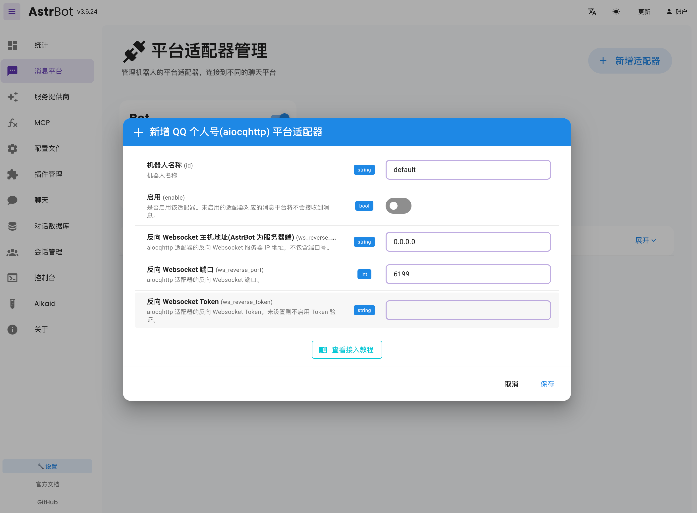

import { LinkPreview } from 'astro-pure/advanced'
import { Steps } from 'astro-pure/user'

先贴出文档

<LinkPreview href='https://docs.astrbot.app' />
<LinkPreview href='https://napcat.napneko.icu' />

---

得益于 AstrBot 和 NapCat 的强大功能，QQBot 的接入确实是非常方便了

## NapCat 配置

<Steps>
1. 安装 NapCat

   在 Linux 下可以直接使用官方的一键支持脚本

   ```bash
    curl -o \
    napcat.sh \
    https://nclatest.znin.net/NapNeko/NapCat-Installer/main/script/install.sh \
    && sudo bash napcat.sh \
    --tui
    ```

    按照指示安装即可，唯一要注意的是在 napcat 的日志里会显示 WebUI 链接，一般端口是 6099

2. 启动

   ```bash
    # 启动 Napcat (需要图形环境或 Xvfb)
    sudo xvfb-run -a qq --no-sandbox


    # 后台启动 (使用 screen) (请使用 root 账户)
    #   启动
    screen -dmS napcat bash -c "xvfb-run -a qq --no-sandbox"

    #   带账号启动
    screen -dmS napcat bash -c "xvfb-run -a qq --no-sandbox -q QQ号码"

    #   附加到会话
    screen -r napcat

    #   停止会话
    screen -S napcat -X quit
    ```

3. 配置

   <Steps>
   1. 添加网络配置
       
       

   2. 如图配置

       
   </Steps>
</Steps>


至此 我们已经完成了 NapCat 的配置


## AstrBot 配置

这边我直接在 1Panel 部署 AstrBot，因为其已经上架了 1Panel 的应用市场。

开放 6158 端口后，我们直接进到 Web UI 进行配置

在 **消息平台 > 新增适配器** 中选择 **接入 QQ 个人号(aiocqhttp)**，按照下图配置即可



至此，我们已经完成了所有的配置，接下来可以在 AstrBot 的 Web UI 中进行测试和使用。

import { Aside } from 'astro-pure/user'

<Aside>

这边附加一下，由于 Google 的相关 api 的免费额度很大，但是在国内服务器可能无法正常访问，这边有一个临时可用的反代：`https://dynamic-halva-76bb38.netlify.app/`，可以直接代替原本的 API Base URL。

可使用 `gemma-3-27b-it`， 每天免费 14400 次。

</Aside>