import { GithubCard } from 'astro-pure/advanced'
import { LinkPreview } from 'astro-pure/advanced'
import { MdxRepl } from 'astro-pure/user'

该实现方式是我在完成校内大作业的时候想到的，并已经在实际项目中得到了应用。通过将自然语言处理与图像检索相结合，我们能够以极低的成本实现高效的图像搜索功能。

项目 Github 链接：

<GithubCard repo='ShotMeld/Shotmeld-server' />

目前常规的“文搜图”基础普遍依赖“向量搜索（Vector Search）”的方式实现，但是势必依赖较好的服务端资源，可惜我们这边当时并没有那么好的条件 QwQ，所以只能使用非常 <del>投机取巧</del> 灵活的方式去实现这个功能。

---

## 常规实现——向量搜索

当然，我们用的不是这个方法，我只是这边贴一下，方便顺便学习。不过这个也是最主流，效果更好的方法，如果不差钱，这个是最推荐的。不过我的方法也是在这上面延伸出来的。

就算是正常的“向量搜索（Vector Search）”也会把“文搜图”工作分成如下几步：

1. **理解图片 (Image Understanding)**

   当将照片存入相册或图库时，AI模型（如深度学习中的卷积神经网络CNN或Vision Transformer）会自动分析每一张照片。

   它会识别出照片中的各种元素，例如：

   - **物体:** 猫、狗、汽车、桌子、电脑
   - **场景:** 海滩、城市街道、森林、室内房间
   - **动作:** 跑步、微笑、吃饭、弹吉他
   - **属性:** 蓝色、圆形、大的、模糊的

   然后，AI会将这些复杂的视觉信息转换成一个数学表示，称为 **“图像嵌入” (Image Embedding)** 或“特征向量”。这个向量可以被看作是这张照片在AI“大脑”中的一个独一无二的“语义坐标”。

2. **理解文字 (Text Understanding):**

   - 当在搜索框中输入文字，比如“在海边奔跑的金色小狗”时，另一个AI模型（如BERT或CLIP的文本部分）会来处理这段文字。
   - 它会分析这段话的语法和语义，理解其中的关键概念（海边、奔跑、金色、小狗）。
   - 同样地，AI也会将这段文字转换成一个数学表示，称为 **“文本嵌入” (Text Embedding)**。

3. **匹配和搜索 (Matching and Searching):**

   - 现在，AI有了代表您搜索词的“文本向量”和代表每一张照片的“图像向量”。
   - 最关键的一步是，这些向量存在于同一个“多模态语义空间”中。在这个空间里，意思相近的文本和图片，它们的向量坐标也相近。
   - 因此，系统只需要计算您的文本向量与图库中所有图像向量的“距离”，然后将距离最近、最匹配的那些照片作为搜索结果返回给您。

上面的就是向量搜索的方法，也是业内主流采用的方式

----

## 奇技淫巧

正题开始！

仿照上面的思路，我将“文搜图”的工作分成了两步：

- 图片转描述词
- 搜索词匹配描述词

图片转描述词这步其实蛮简单的，只要把它理解成“图片打标”，就有许多现成的 API 可以用，比如我当时用的阿里家的

<LinkPreview href='https://help.aliyun.com/zh/viapi/developer-reference/api-t057e7' />

接下来一步就很神奇，我们从 api 那边拿到了每个图片的标签，我们该如何用这些标签去匹配用户的搜索词呢？当然，正常的方法是词向量匹配，但是由于相同的原因，所以我就想到了用 LLM 来做这个匹配。

（当时没有使用词向量的原因和上面差不多，但是当时傻，不知道有文本向量特化模型，下面我会说到）

流程如下



流程很好解决，接下来就是一些细节的处理

### 信息设计

#### 输入信息

- **标签库**：JSON 格式的标签列表，例如

  ```json
  {"tags": ["旅行", "时尚", "化妆", "风景", "美食"]}
  ```

- **搜索查询**：用户输入的搜索内容，例如：“旅行”。

#### 输出要求

- 以 JSON 格式返回匹配标签列表，格式为：

  ```json
  {"matched_tags": ["标签1", "标签2", ...]}
  ```

- 规则：

  - 输出必须为合法 JSON，仅包含 `matched_tags` 数组。
  - 不能包含解释、注释或额外文本。
  - 若无匹配标签，则返回 `{"matched_tags": []}`。

### 提示词设计

这边就需要我们去用心设计一个提示词，因为我们需要保证 LLM 稳定地返回我们所需的内容。当然也有一个大家熟知的技巧，用 LLM 来帮我们写提示词。

除了规定其输出规则外，我这边也给了其核心匹配原则：

- 相关性联想：匹配与搜索词在功能、场景或属性上紧密相关的事物。例如，搜索“学习”时，可以关联到“书籍”、“课程”、“考试”等标签。
- 场景化匹配：关键在于理解搜索词背后的场景和需求。举个关键例子：如果用户搜索“湖水”，你不仅要匹配“湖”，更需要智能地联想到相关的“河”、“江”、“溪”、“水”等，因为它们都属于“水体”这一核心概念。

确保 AI 能给我更好的匹配效果

<MdxRepl width='100%'>
<p>提示词</p>
<Fragment slot='desc'>
  ```plaintext
  角色与目标 (Role & Goal):
你是一位专精于概念关联与语义理解的智能标签匹配引擎。你的核心任务是深入分析用户的搜索意图，并从一个给定的标签库中，广泛地匹配出所有相关的标签。

核心匹配原则 (Core Matching Principles):
你的匹配不应局限于字面上的同义词，而必须扩展到更广泛的语义关联维度：

相关性联想 (Associative Relevance): 匹配与搜索词在功能、场景或属性上紧密相关的事物。例如，搜索“学习”时，可以关联到“书籍”、“课程”、“考试”等标签。
场景化匹配 (Contextual Matching): 关键在于理解搜索词背后的场景和需求。举个关键例子：如果用户搜索“湖水”，你不仅要匹配“湖”，更需要智能地联想到相关的“河”、“江”、“溪”、“水”等，因为它们都属于“水体”这一核心概念。

输入信息 (Input Information):

所有标签的 JSON 文件如下：
${JSON.stringify({ tags: allTags }, null, 2)}

用户的搜索内容是：
${searchQuery}

输出要求 (Output Requirements):

请根据上述原则，匹配出与搜索内容相关的所有标签，并仅以 JSON 格式返回匹配的标签列表。

返回格式示例：
{ "matched_tags": ["tag1", "tag2"] }

严格遵守以下规则 (Strict Rules):

只返回 JSON：绝对不要添加任何解释、注释或额外的文字。
结果必须是有效的 JSON 数组。
若无相关标签：返回一个包含空数组的 JSON 对象，即 {"matched_tags": []}。
  ```
</Fragment>
</MdxRepl>

### API 请求示例

<MdxRepl width='100%'>
<p>请求示例代码</p>
<Fragment slot='desc'>
  ```js
import OpenAI from "openai";

const openai = new OpenAI({
  apiKey: process.env.API_KEY,
  baseURL: "https://dashscope.aliyuncs.com/compatible-mode/v1",
});

async function main() {
  const tags = ["旅行", "时尚", "化妆", "风景", "美食"];
  const searchQuery = "旅行";
  const prompt = `
   角色与目标 (Role & Goal):
    你是一位专精于概念关联与语义理解的智能标签匹配引擎。你的核心任务是深入分析用户的搜索意图，并从一个给定的标签库中，广泛地匹配出所有相关的标签。

   核心匹配原则 (Core Matching Principles):
    你的匹配不应局限于字面上的同义词，而必须扩展到更广泛的语义关联维度：
        相关性联想 (Associative Relevance): 匹配与搜索词在功能、场景或属性上紧密相关的事物。例如，搜索“学习”时，可以关联到“书籍”、“课程”、“考试”等标签。
        场景化匹配 (Contextual Matching): 关键在于理解搜索词背后的场景和需求。举个关键例子：如果用户搜索“湖水”，你不仅要匹配“湖”，更需要智能地联想到相关的“河”、“江”、“溪”、“水”等，因为它们都属于“水体”这一核心概念。
   输入信息 (Input Information):
       所有标签的 JSON 文件如下：
        ${JSON.stringify({ tags: allTags }, null, 2)}

        用户的搜索内容是：
        ${searchQuery}

   输出要求 (Output Requirements):
    请根据上述原则，匹配出与搜索内容相关的所有标签，并仅以 JSON 格式返回匹配的标签列表。

   返回格式示例：
    { "matched_tags": ["tag1", "tag2"] }

   严格遵守以下规则 (Strict Rules):
    只返回 JSON：绝对不要添加任何解释、注释或额外的文字。
    结果必须是有效的 JSON 数组。
    若无相关标签：返回一个包含空数组的 JSON 对象，即 {"matched_tags": []}。
     `;

  const completion = await openai.chat.completions.create({
    model: "qwen-turbo",
    messages: [
      { role: "system", content: "你是一个智能助手。" },
      { role: "user", content: prompt },
    ],
  });

  console.log(completion.choices[0].message.content);
}

main();
  ```
</Fragment>
</MdxRepl>

这边我采用的是 `qwen-turbo` 模型，主要看中其速度，十次平均 420ms。

import { Aside } from 'astro-pure/user'

<Aside type="tip">

我虽然当时采用的是 `qwen-turbo` ，而实际上我们完全可以使用“阿里通用文本向量-v4(text-embedding-v4)”这类特化模型，他们不是思考，而是纯粹的数学计算，延迟更低，效果更好，可惜当时傻，我有时间会去重新做这一块。

不过这样上面的 API 请求什么都不一样，可以参考

<LinkPreview href='https://bailian.console.aliyun.com/?spm=a2c4g.11186623.0.0.3adc55efAtoAJ4&tab=doc#/doc/?type=model&url=2842587' />
</Aside>

## 评估

### 优点
1. 成本极低，无论是图像打标还是 LLM 对话
2. 实现简单
3. 效果好：利用大语言模型做“语义理解”的中间层，比传统的关键词匹配要智能得多

### 缺点

1. **搜索的粒度和深度有限**

   - 关系丢失: 图像打标API通常返回的是离散的、名词性的标签，它们之间没有关系。比如一张“一个男人在追逐一只狗”的照片，标签可能是`["男人", "狗", "奔跑", "草地"]`。无法通过这些标签搜索“谁在追谁”这种带有关系和动作主体的复杂场景。系统可以找到同时包含这些标签的照片，但无法理解它们之间的逻辑。
   - 属性和细节丢失: 对于“穿红色裙子的女孩”这样的搜索，如果打标API只返回了`["女孩", "裙子"]`而没有“红色”这个属性，搜索就会失败。标签的质量完全决定了搜索结果的上限。

2. **结果排序困难**

   这个方案本质上是“布尔搜索”（要么匹配，要么不匹配）。如果多个结果都匹配了AI返回的标签（例如，10张照片都有“河流”和“日落”的标签），很难判断哪一张是**最**匹配用户描述的。而真正的向量搜索可以根据向量距离进行排序，给出最相关的结果。

---

## 后日谈

上面的内容产出都是我在当时做那个项目的时候思考的，也实际使用了，你也可以去试试看效果

<LinkPreview href='https://shotmeld.seeridia.top' />

当然我上面也提到了，我当时并不知道阿里云那边也有专门的文本向量模型，我知道词向量，但是由于服务器拉了没法本地跑就没用了。

而结果是这个模型更便宜，效果更好，延迟更低 QwQ，确实是有点小伤心的，不过在这边也学到蛮多的，没办法，有时间去换一换吧，之后再更新这篇文章