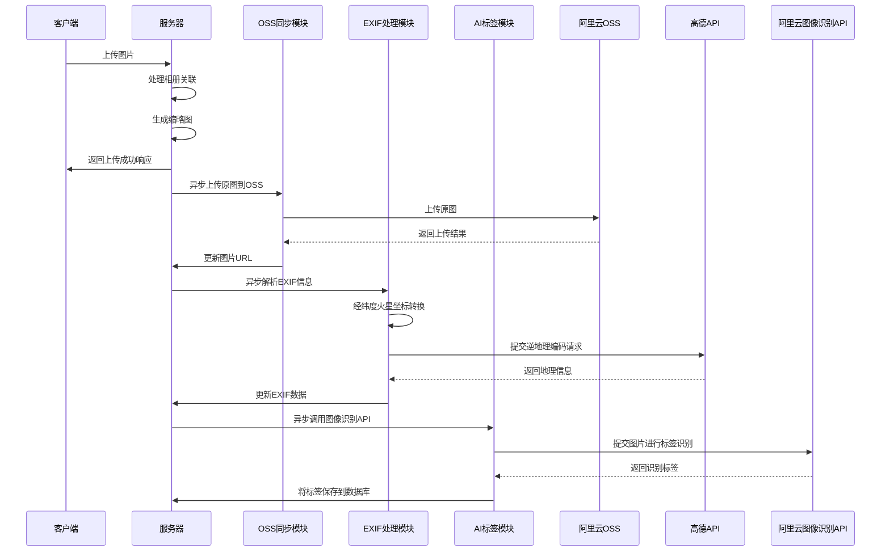

import { Steps } from 'astro-pure/user'
import { GithubCard } from 'astro-pure/advanced'
import { LinkPreview } from 'astro-pure/advanced'

同样源自于大一的大作业 Shotmeld 项目

<GithubCard repo='ShotMeld/Shotmeld-server' />

先把最终流程摆出来吧



下面开始讲讲思考

## 上传流程设计思路

### 初版云端上传流程与初步优化

最初的上传流程非常简单：

<Steps>
1. 客户端直接上传图片至服务器。
</Steps>

随着功能迭代，我们意识到首页展示多张图片时，不应直接使用原图，因此增加了缩略图步骤：

<Steps>
1. 客户端上传图片至服务器。
2. 服务器创建一张体积小于 100KB 的缩略图。
3. 首页加载缩略图，点击后加载原图。
</Steps>

然而，这并未解决原图访问速度慢的根本问题。更重要的是，后期我们集成了更多图片处理功能，使得流程愈发复杂：

<Steps>
1. 客户端上传图片至服务器。
2. 处理图片与相册的关联。
3. 创建缩略图。
4. 解析图片 EXIF 信息（拍摄时间、光圈、快门速度等）。
5. 对 EXIF 中的经纬度进行火星坐标系转换。
6. 将转换后的经纬度提交至高德 API 进行逆地理编码。
7. 将图片提交至阿里云图像识别 API 以获取标签。
8. 将识别出的标签存入图片关联数据库。
9. 向客户端返回上传成功的响应。
</Steps>

在这一系列同步操作下，处理单张图片的时间飙升至致命的 15 秒。相比之下，这些操作在本地环境中几乎是瞬时完成的。这揭示了一个在纯本地开发时难以预见的性能瓶颈，也促使我们着手解决。

### 引入阿里云 OSS：提升访问速度

为解决服务器带宽和存储的瓶颈，我们引入了 阿里云对象存储（OSS）服务。OSS 的以下特性对我们的项目尤为关键：

- 海量存储 （Massive Storage）：OSS 采用“桶（Bucket）”和“对象（Object）”的扁平结构，理论上容量无限，可按需自动扩展，无需预估硬盘空间。
- 高可靠性 （High Reliability）：阿里云承诺极高的数据持久性（12 个 9），通过多副本冗余机制将数据分散存储于不同物理设备和可用区，有效防止单点故障。同时支持版本控制，防止意外删除或覆盖。

最重要的是，OSS 能够显著提升用户访问图片的速度。经过一番文档研读和在 AI 辅助下的集成，我们将所有文件存储逻辑迁移到了 OSS。

迁移后效果显著：常规 5MB 大小的图片，访问时间能控制在 0.5 秒以内。

### OSS 迁移后的新挑战：上传速度恶化

尽管访问速度大幅提升，但上传流程变为：

<Steps>
1. 客户端上传图片至服务器。
2. 服务器将图片上传至 OSS。
3. 处理图片与相册的关联。
4. 创建缩略图。
5. 解析图片 EXIF 信息。
6. 经纬度火星坐标转换与逆地理编码。
7. 阿里云图像识别 API 获取标签。
8. 保存标签至数据库。
9. 向客户端返回上传成功的响应。
</Steps>

不难想到的是，尽管用户访问图片能获得更好的体验，由于增加了服务器到 OSS 的中转环节，图片上传时间反而延长至 20 秒，情况变得更糟。

### 最终解决方案：异步处理优化

为彻底解决上传耗时问题，我们设计并实施了最终的异步处理工作流：

<Steps>
1. 即时响应阶段（同步处理）：

   1. 客户端上传文件至服务器
   2. 服务器处理相册关联等即时性操作
   3. 服务器快速生成缩略图
   4. 服务器立即向客户端返回上传成功的响应（此时图片暂时由服务器承载，优先保障用户能第一时间查看和操作）。

2. 后台异步处理阶段：

   <Steps>
   1. OSS 同步模块：
      1. 将原图和缩略图异步上传至 OSS
      2. 待 OSS 上传完成后，更新数据库中图片的 URL 指向 OSS
      3. EXIF 处理模块：
         1. 异步解析图片 EXIF 信息
         2. 进行经纬度火星坐标转换
         3. 调用高德 API 进行逆地理编码
         4. 将处理后的 EXIF 数据更新至数据库

   2. AI 标签模块：
      1. 异步调用阿里云图像识别 API 获取图片标签
      2. 将获取的标签保存至数据库
   </Steps>
</Steps>

通过上述优化，对于一张约 2MB 的普通图片，我们成功将上传时间控制在 2 秒以内，同时保持了查看速度在 0.3 秒以内的优异表现。

## Appendix

### 地图坐标转换

我们在 Exif 解析的时候，想要根据 Exif 中的信息来得到一个结构化的地址（例如 福建省福州市福州大学（旗山校区） 这样的具体名称），而非仅仅是经纬度坐标。为此，我们需要引入高德 API 进行逆地理编码。

但是在这之前，需要知道的是：

1. 中国大陆境内采用的都是 GCJ-02 坐标系（火星坐标系），而非 WGS-84 坐标系（GPS 坐标系）
2. 图片 Exif 中存储的经纬度信息是 WGS-84 坐标系
3. 高德 API 的逆地理编码只支持 GCJ-02 坐标系，因此我们需要将 WGS-84 坐标系转换为 GCJ-02 坐标系

我自己是直接使用 高德 API 提供的坐标转换接口来完成的，当然也可以直接本地转换

<LinkPreview href='https://lbs.amap.com/api/webservice/guide/api/convert' />

<GithubCard repo='wandergis/coordtransform' />

```js
/**
 * 将GPS（WGS84）坐标转换为高德（GCJ-02）坐标系并获取位置名称
 * @param {number} longitude - GPS经度
 * @param {number} latitude - GPS纬度
 * @returns {Promise<{longitude: number, latitude: number, name: string|null}>} - 包含高德坐标和位置名称的对象
 */
async function convertGPSToAMap(originalLongitude, originalLatitude) {
  try {
    // 验证输入坐标的有效性
    if (typeof originalLongitude !== 'number' || typeof originalLatitude !== 'number' ||
        isNaN(originalLongitude) || isNaN(originalLatitude)) {
      throw new Error('无效的坐标值');
    }

    // 确保有API Key
    if (!config.AMAP_KEY) {
      console.warn('未配置高德地图API Key，无法进行坐标转换和逆地理编码');
      return { longitude: originalLongitude, latitude: originalLatitude, name: null };
    }

    let amapLongitude = originalLongitude;
    let amapLatitude = originalLatitude;
    let locationName = null;

    // 1. 坐标转换 (WGS84 to GCJ-02)
    const convertUrl = `https://restapi.amap.com/v3/assistant/coordinate/convert?key=${config.AMAP_KEY}&locations=${originalLongitude},${originalLatitude}&coordsys=gps`;
    try {
      const convertResponse = await axios.get(convertUrl);
      if (convertResponse.data && convertResponse.data.status === '1' && convertResponse.data.locations) {
        const [lon, lat] = convertResponse.data.locations.split(',');
        amapLongitude = parseFloat(lon);
        amapLatitude = parseFloat(lat);
      } else {
        console.error('高德地图坐标转换API返回错误:', convertResponse.data);
      }
    } catch (convertError) {
      console.error('高德地图坐标转换失败:', convertError);
    }
    
    // 2. 逆地理编码获取位置名称 (使用转换后的或原始的高德坐标)
    const locationStringForRegeo = `${amapLongitude},${amapLatitude}`;
    const regeoUrl = `https://restapi.amap.com/v3/geocode/regeo?key=${config.AMAP_KEY}&location=${locationStringForRegeo}&extensions=base`;
    
    try {
        const regeoResponse = await axios.get(regeoUrl);
        if (regeoResponse.data && regeoResponse.data.status === '1' && regeoResponse.data.regeocode) {
          locationName = regeoResponse.data.regeocode.formatted_address;
        } else {
          console.error('高德地图逆地理编码API返回错误:', regeoResponse.data);
        }
    } catch (regeoError) {
        console.error('高德地图逆地理编码失败:', regeoError);
    }

    // 返回转换后的高德经纬度和获取到的位置名称
    return {
      longitude: amapLongitude,
      latitude: amapLatitude,
      name: locationName
    };

  } catch (error) {
    console.error('获取位置名称或坐标转换主流程失败:', error);
    return { longitude: originalLongitude, latitude: originalLatitude, name: null }; 
  }
}
```