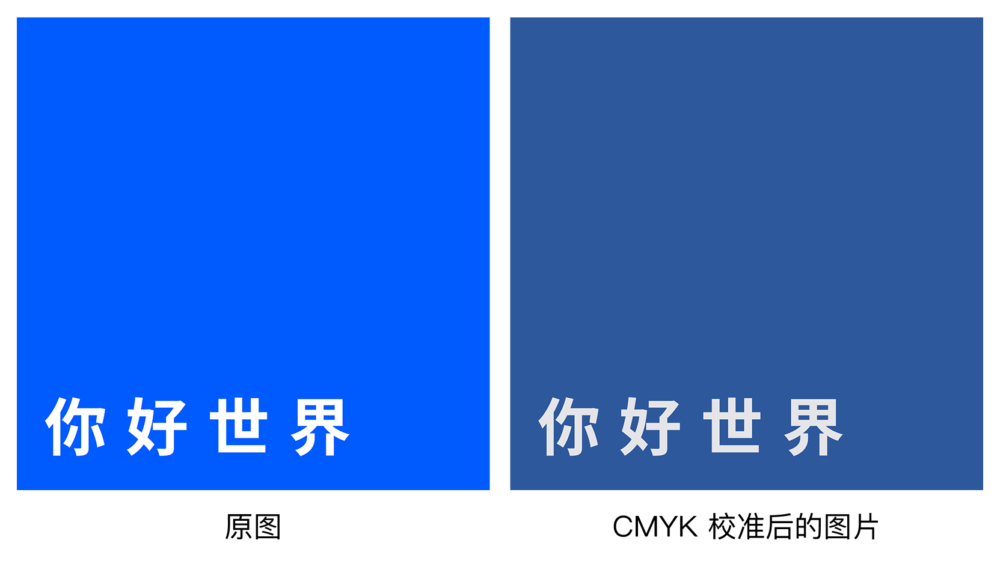
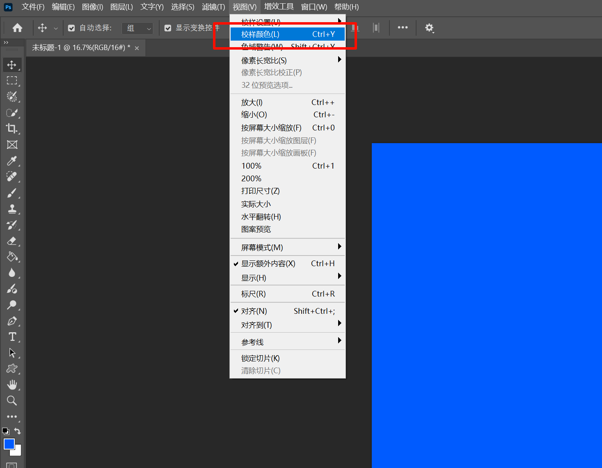
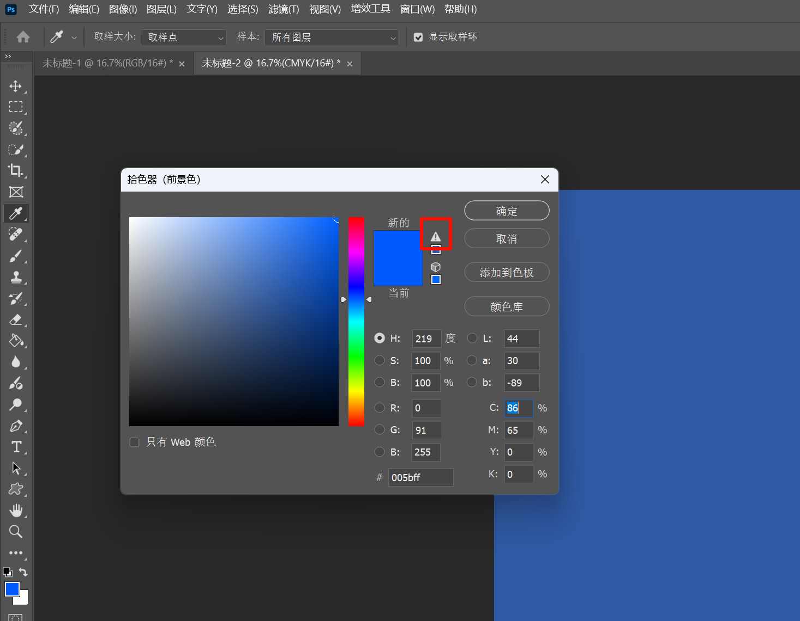

import { Aside } from 'astro-pure/user'

本文主要面向非专业设计人员，比如只是在学校里面做做海报什么的，目标也只是普通的小文印店，而非专业的印刷厂。介绍打印色彩的基础知识以及文件交付的注意事项，帮助大家更好地理解打印色彩，避免或尽力减少在打印过程中出现色差等问题。

## 色彩基础

这部分不会太深入，主要介绍一些基础的色彩知识，帮助大家理解打印色彩。

### sRGB

sRGB 是 1996 年由微软和惠普制定的一个标准色彩空间，最初是为了网络和普通显示器而设计的。几乎所有的手机、电脑、平板、网页浏览器默认使用 sRGB 作为显示标准。他是一种加色模型，主要通过红（Red）、绿（Green）、蓝（Blue）三种颜色的光线叠加来显示颜色。

### CMYK

CMYK 是一种减色模型，主要用于印刷领域。CMYK 由下面四种颜色的油墨组合而成：

1. 青（Cyan）
2. 品红（Magenta）
3. 黄（Yellow）
4. 黑（Key）

通过叠加这四种颜色的油墨，可以生成各种颜色。与 RGB 不同，CMYK 是通过吸收光线来显示颜色的。因此在转换过程中可能会出现色差。

<Aside>
**加色模型 与 减色模型**

1. **加色模型**：通过叠加不同颜色的光来产生新的颜色。当三种颜色的光线以不同强度叠加时，可以产生各种颜色，最终叠加到白色光。

2. **减色模型**：通过吸收光线来产生新的颜色。在印刷过程中，油墨的叠加会吸收不同波长的光，从而生成各种颜色，最终叠加到黑色。

**sRGB** 是一种基于 **RGB 模型**的标准色彩空间，广泛用于显示器、相机、网页等数字设备。

- 屏幕上的每个像素由红、绿、蓝三个子像素组成。
- 当这些子像素发出不同强度的光并混合时，人眼感知到不同的颜色。
- 例如：
  - 红光 + 绿光 = 黄光
  - 红光 + 蓝光 = 品红光
  - 绿光 + 蓝光 = 青光
  - 红 + 绿 + 蓝（全开）= 白光
  - 全关 = 黑色

CMYK 用于印刷，依赖纸张反射环境光来显色。

- 纸张本身是白色的，会反射所有可见光。
- 油墨的作用是**吸收（减去）某些颜色的光**，只反射我们看到的颜色。
  - 青色油墨吸收红光，反射绿光和蓝光（合成青色）
  - 品红油墨吸收绿光，反射红光和蓝光（合成品红）
  - 黄色油墨吸收蓝光，反射红光和绿光（合成黄色）

-  当你叠印油墨时：

  - 青 + 品红 = 吸收红和绿，只反射蓝 → 蓝色

  - 青 + 黄 = 吸收红和蓝，只反射绿 → 绿色

  - 品红 + 黄 = 吸收绿和蓝，只反射红 → 红色

  - 青 + 品红 + 黄 = 理论上吸收所有光 → 黑色（但实际上呈深棕，所以加入 K——纯黑油墨）

</Aside>

## 色彩损失

所以，我们知道了在电脑屏幕上使用的是 RGB 色彩空间，而打印使用的是 CMYK 色彩空间。而 RGB 色彩空间的颜色范围要大于 CMYK 色彩空间的颜色范围。在将 RGB 颜色转换为 CMYK 颜色时，可能会出现色彩损失，导致打印效果与屏幕显示不一致。

下图展示了在 CIE 1931 xy 色度图中，sRGB 和 CMYK 色域的对比。可以看到，CMYK 色域明显小于 sRGB 色域：

<small>图来源于 [维基百科](https://en.wikipedia.org/wiki/CMYK_color_model#/media/File:CIE1931xy_gamut_comparison.svg)</small>

同时的，你也可以从图上很明显的看到，RGB → CMYK 的主要差别在鲜艳度和色域范围，典型情况是 **鲜艳的蓝色、绿色、紫色、橙色**，在这些颜色上，CMYK 都会比 sRGB 差很多。

下面展示一个个人的死亡案例

（CMYK 校准后的图片 即 模拟打印设备的打印效果）

笔者本人很大胆地使用了非常鲜艳的蓝色作为海报的主色调，直到设计完成后，才发现打印出来的效果和屏幕上差别巨大，蓝色变得非常暗淡，完全失去了原本的鲜艳感。

## 色彩空间选取

通过上面的描述，我们知道了 RGB 和 CMYK 的区别，以及在转换过程中可能会出现色彩损失。那么，在从设计到交付的全流程中，我们是否是要一直使用 CMYK 色彩空间呢？

**我认为的答案是在设计阶段 依然选择 sRGB**

逻辑如下：

1. **从文印店的实际情况触发**

  - 普通的文印店不可能提供 ICC Profile 给你。

  <Aside>
  **ICC Profile**

  它描述了“某种设备/油墨/纸张下，CMYK 数字值对应的真实颜色”。

  如果你用 ICC 转换 RGB → CMYK，就能更准确地模拟印刷效果。
  </Aside>

  - 文印店多数是数码打印机（激光/喷墨复印机），不是传统四色胶印。这些数码机内部往往有 多色墨盒（CMYK+额外的浅青、浅洋红，甚至橙/绿，例如拓展的 CMYKcm等等），驱动会自动做色彩转换和优化。

2. **如果你交 sRGB**

  - 打印机驱动会根据 自身 ICC / 内部算法 做转换，尽量保留饱和度和细节。

  - 如果机器支持多色墨盒，可能比传统 CMYK 打出来的效果更好（比如蓝色会更亮，绿色会更正）。

  - 相当于“把选择权交给打印机”，往往比你自己手动转 CMYK 更好，尤其是非专业的文印店。

3. **如果你交 CMYK**

  - 你交的数值就固定了，打印机不会再帮你优化。

  - 如果你用的是普通 CMYK（比如 ISO Coated v2），就等于人为先把颜色砍掉一部分，可能比直接交 sRGB 更差。

  - 打印效果 → 蓝、绿、橙、紫更容易显得暗淡。

所以在最开始的设计阶段，依然建议使用 sRGB 色彩空间进行设计。当然，在设计过程中，也有一些额外的注意事项。

**但是，在我看来有下面这种情况更适用于使用 CMYK**

如果你一开始就明确自己追求打印出来的颜色效果尽可能接近设计稿，并且自己确定不会使用过于鲜艳的蓝色、绿色、紫色、橙色等 CMYK 没有覆盖的颜色，那么你也可以选择在设计阶段就使用 CMYK 色彩空间进行设计。

当然，如果是只用于在网络上展示的设计稿，那当然肯定是使用 sRGB 色彩空间。

## 设计阶段

如果使用 sRGB 色彩空间进行设计，建议注意以下几点：

- 尽量避免使用过于鲜艳的蓝色、绿色、紫色、橙色等颜色。

- 如果必须使用，建议在设计软件中开启 CMYK 预览功能，查看这些颜色在 CMYK 下的表现。

如果使用 CMYK 色彩空间进行设计

- 避免使用超出 CMYK 色域的颜色

（Photoshop 会提示当前选取的颜色是否超出 CMYK 色域）