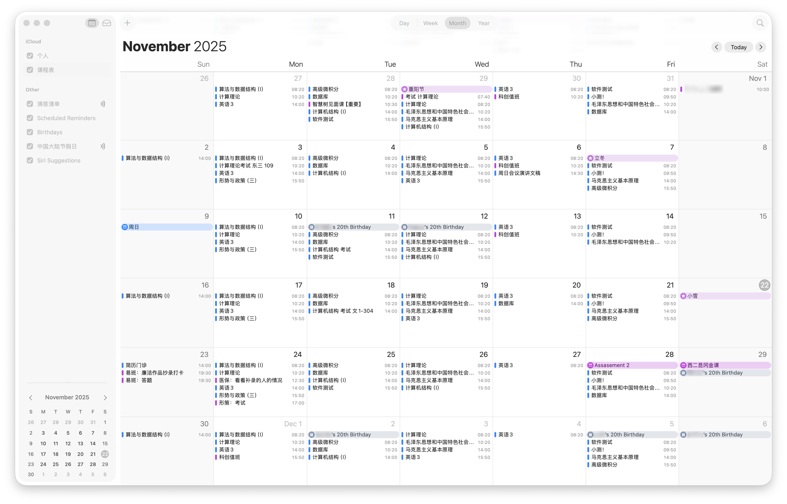
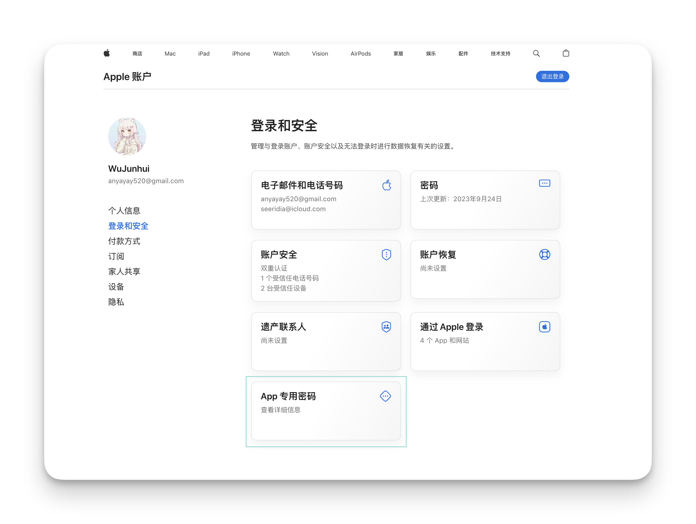
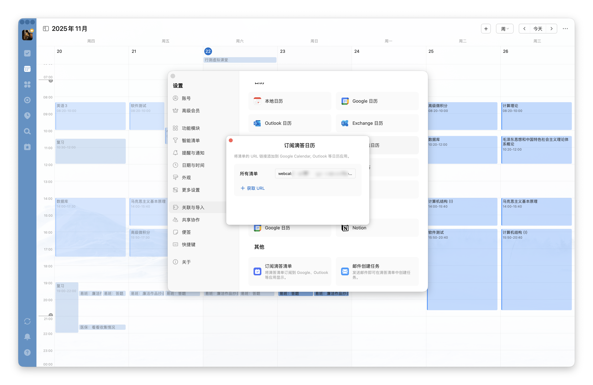
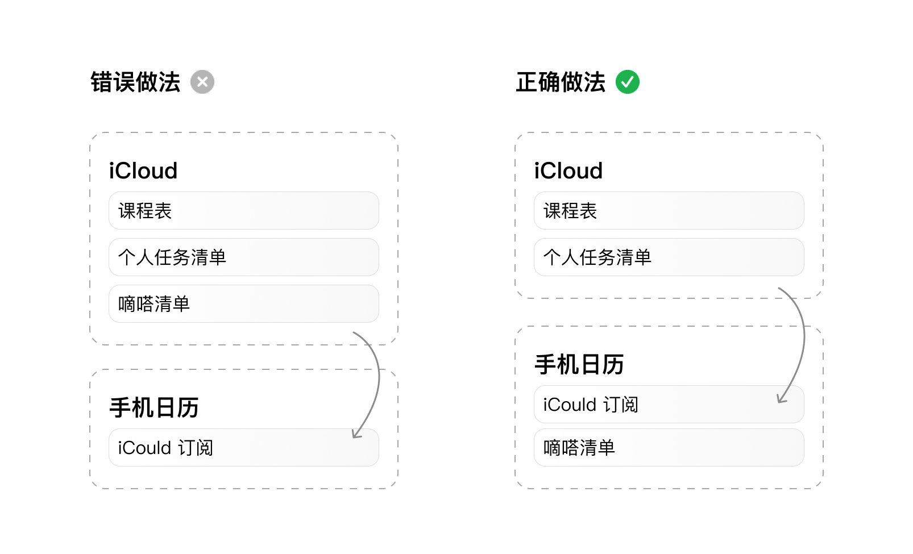
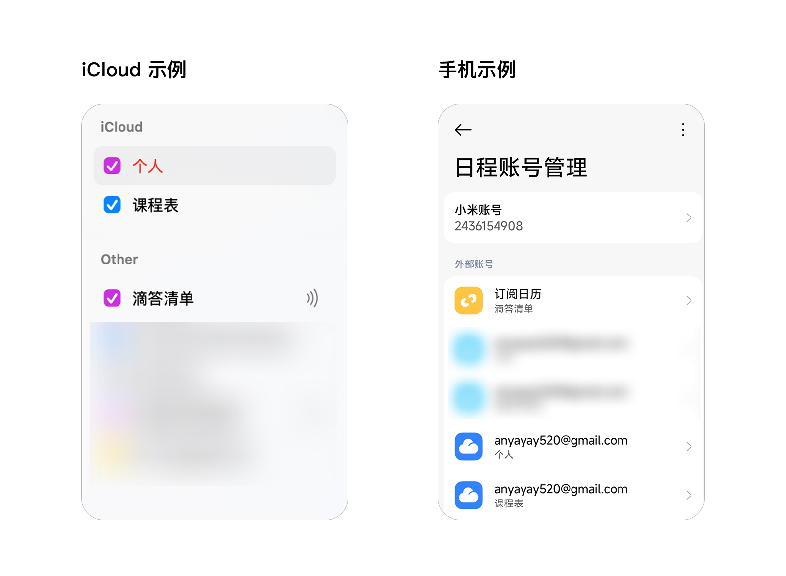

没有之一，日程管理永远是大学生活中最重要的技能之一。

或许如我刚进大学的时候，不做日程管理，或许也过得很好。要做什么，真就是用脑子想一想就能记住的。作业？截止前自然有人提醒；考试？考前一两周自然老师会反复强调。

但是，随着时间的推移，任务越来越繁重，单靠记忆已经远远不够了。甚至是经常遇到，今天突然告知我下个月要做啥事，这天才能想得起来）

而日程的管理，不仅仅解决的是“记住要做什么”的问题，更重要的是“合理安排任务”的问题。

## 最为基础的方式：使用日历

> 主包目前实际用的方式比较复杂了，在后面的章节里面，但是这个方式还是目前最推荐的，因为简单易行。也因此这边图片不多，主要是文字说明。

虽说是最简单的，但也是目前最实用的方式。

我更推荐就直接使用手机自带的日历应用，因为既然我们选择了这种方式，我们就要从简，不仅仅是初次配置的简化，更重要的是后续的使用简化。不能让日历的使用变成一件麻烦事，否则就失去了意义——你坚持不了多久。

### 日历的配置

我下面都以我自己的手机（小米家的 HyperOS 3）为例，来说说配置，这边仅供参考，其他手机的日历应用大同小异。

一个是创建多个日历（日程集，或者说是日程分类），我当时的方案是只有两个：「课程表」和「任务清单」。

**课程表**：我使用的是订阅的方式，比如福州大学的 西二 团队开发的福 uu 课程表，提供了日程订阅的功能，直接订阅就行了。这样就不需要手动添加上课时间了。

对于其他学校的同学，如果学校没有提供类似的课程表订阅功能，可以考虑自己手动录入，或者不在日历里面做这个日程分类，用你们自家的课程表 App 或是小程序还是 Wakeup 之类的来查看上课时间。我自己的这个主要是为了能在一个表里面看到包含课程表在内的所有日程，方便我去安排，而非日历看一下，自己的 App 看一下，这不优雅～

**任务清单**：则是我自己手动添加的，主要是把所有需要做的任务都添加进去。这里的任务包括作业、考试、活动、会议等等一切需要你去做的事情。事情可以无关大小，重要与否，甚至是提醒自己晚饭后要去拿个快递这种小事也可以添加进去。总之，凡是你需要记住的事情，都可以添加进去。

因为我们在这个阶段的设计目标是：

1. 提醒自己要做什么事
2. 自己要安排某一个事情的时候知道具体的时间有没有空

所以，这两个日历就足够了。

### 那我们该如何使用呢？

我们最重要的是保证你能把日程管理这个给坚持下来。所以，最重要的就是**简单**。我就是直接「小爱同学，提醒我明天早上 8:00-9:00 做下高级微积分的作业」，这样，这个日程便添加进来了。你也可以直接在日历 App 里面添加，反正就是简单快捷。

这边也可以给一谢可以参考的日程提示（有哪些事情添加进去）：

- 赚德育分的任务，比如每天要我签到、让我每天拍个照
- 课程作业的截止时间
- 考试时间

## 再多一点：全平台同步的日历

比如我有多个设备，小米、华为、iPhone、Mac、Windows 电脑等等，这些设备上都需要查看日程，甚至或许有在 Google 日历上面使用的需求。我该如何做到呢？

这个时候，我们就需要一个全平台同步的日历服务了。可以考虑使用 Google 日历、Outlook 日历等服务，它们都提供了跨平台的支持，可以在不同设备上查看和管理日程。

这边并不是说你需要下载他们对应的 App，而是说你可以把你手机上面的日历和这些服务进行同步。这样，无论你在哪个设备上查看日程，都是一致的。

而我最推荐的是 iCloud 日历服务，尤其是对于苹果设备用户来说，iCloud 日历的集成度非常高，使用体验也非常好。还有一个好处是，iCloud 可以在任何网络环境下运行，这对于国内用户来说是一个很大的优势。

### iCloud 日历的配置

import { Steps } from 'astro-pure/user'

<Steps>
1. 得先有一个 Apple ID，如果没有的话，自己去注册一个
2. 在 iCloud 上创建好自己的日历，至于日历里面的日历分类有哪些，请你参考上一节

    但是我没有 Apple 设备怎么办？

    iCloud 日历可以通过网页访问，所以你完全可以在 Windows 或者其他 Android 设备上使用 iCloud 日历。只需要在浏览器中登录你的 Apple ID，然后访问 iCloud.com，就可以使用日历功能了。

    > 我们用苹果的 iCloud 日历服务，主要是因为它的稳定性和跨平台支持都非常好，而且在国内的访问速度也比较快。

3. 生成「App 专用密码」

    由于我们要在非苹果设备上使用 iCloud 日历，需要生成一个「App 专用密码」来进行登录。这个密码不同于你的 Apple ID 密码，专门用于第三方应用访问你的 iCloud 数据。类似于个人 token。

    生成方法如下：

    <Steps>
    1. 登录你的 Apple ID 账户页面：[https://appleid.apple.com/](https://appleid.apple.com/)
    2. 在「安全性」部分，找到「生成密码」选项
    
        
    
    3. 按照提示生成一个新的「App 专用密码」并记住他，我们将在后续步骤中使用它。
    </Steps>

4. 在手机上添加 iCloud 账户

    以小米手机的日历为例：

    <Steps>
    1. 打开「日历」应用
    2. 右上角菜单进入「设置」页，再进入「日程账号管理」菜单
    3. 点击底部的「导入账号」
    4. 选择「Caldav 账号」
    5. 填入以下信息：
       
        - 账号：你的 Apple ID 邮箱
        - 密码：刚刚生成的 「App 专用密码」
        - 服务器地址：icloud.com
    </Steps>
</Steps>

至此，你的手机日历就已经和 iCloud 日历同步了。你可以在手机上查看和管理你的日程，这些更改也会自动同步到 iCloud 上，使得所有订阅了该日历的设备都能看到最新的日程信息。

这边也不仅仅是手机，其他设备也是类似的配置方式，只要支持 Caldav 协议的日历应用，都可以通过类似的方式添加 iCloud 账户，实现日程同步，比如：Google 日历、Outlook 日历、Notion 日历、飞书等等。

## 最后一点，将任务管理工具放进来

如果你已经使用了一些任务管理工具，比如 Todoist、Microsoft To Do、TickTick 等等，这些工具大多也支持与日历同步。你可以将这些任务管理工具中的任务同步到你的日历中，这样就能在日历中看到所有的任务和日程，方便你进行整体的时间管理。

我这边用的是 TickTick 嘀嗒清单，这边可以生成一个嘀嗒的任务日历订阅链接，然后把这个链接添加到你的日历中，就能实现任务和日程的统一管理。

**但是**：你或许会将这个订阅在 iCloud，然后想着「由于我手机上面已经订阅了 iCloud 日历，所以我只要在 iCloud 上面添加这个订阅就行了」，但是实际上并不能这样做，虽然你手机上也正确显示出了对应的日程集，但是会发现有错误，**有些任务是直接没有显示出来的。**

正确做法是，在手机上（或是你需要展示任务日历的设备上）直接添加这个订阅链接，这样才能正确显示所有的任务。

> 这边的左图是**不要**把嘀嗒清单订阅添加到 iCloud 上面去（但是可以添加到 apple 设备的本地日历）

虽然我知道这不符合逻辑，但是我疑心觉得这是 iCloud 日历在解析订阅日程时出现的问题，所以只能这样做了。

## 所以

以上便是如此，最下面的方案便是我目前在使用的日程管理方案。目前看来还不错，能够满足我的需求。

（不过冤种的我买了嘀嗒清单的会员，因为实际上貌似这个会员可有可无）

当然，对于上面的最后一部分，如果你觉得太复杂，完全可以忽略这一部分，单纯使用日历来管理你的日程也是完全可以的。当然如果有更好的方案，也欢迎告诉我～