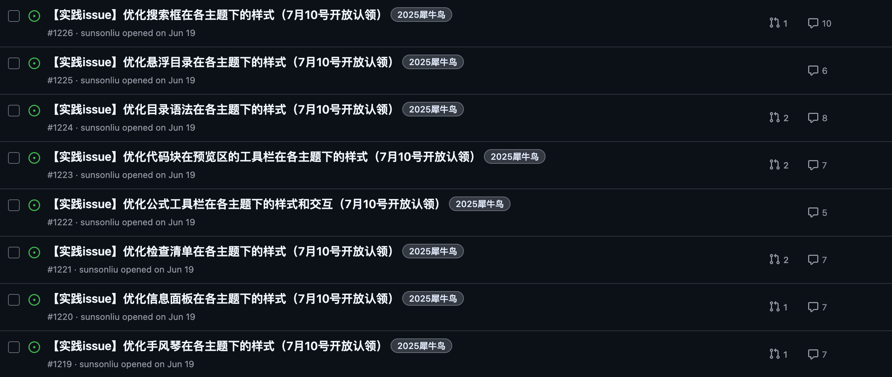
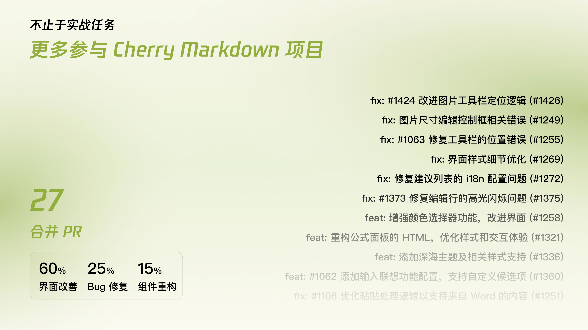
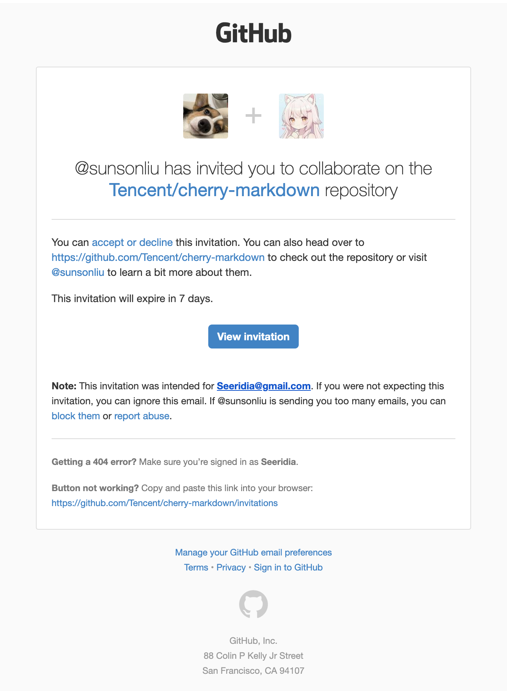

import { LinkPreview } from 'astro-pure/advanced'

<LinkPreview url="https://docs.qq.com/aio/DTk1wUUFHUkZCQkZN?p=kBrlITmKIZYap9DtpMNaox" />

一个偶然的机会，从西二那边的 Open-Source-Application 了解到了腾讯的犀牛鸟，便也想参与其中。

倒不是只是知道这个活动，此前其实也有了解过 OSPP 以及 GSoC 之类的开源活动，只是太菜了，一眼看过去就觉得自己不行，没敢尝试。而犀牛鸟相比就友好得多了，甚至入门的介绍视频是教 Git 的使用的，这甚至是欢迎几乎零基础的同学吗？这倒让我去想着——或许我也行？

就从大前端的三个里面选了一个 Cherry，比较一眼看过去<del>有点水水的？</del>，毕竟看下去全都是样式的改进

这不就是改改 CSS 吗？所在我之前有接触 Typora 的主题的制作（刚好也是 markdown 编辑器），看着项目也颇为熟悉。

于是很自然的选择了这个项目

---

## 从一封邮件开始说起

我看到这个项目的时候其实早在 6 月中旬我就看到了，而这个活动其实在 7 月 10 日才正式开始 issue 的占用和验收。

或许确实是有自己的私心吧，因为这个项目看的就是谁抢的快，做的快，因为项目本身确实是没有什么技术含量的，我确实是是会担心可能会有人比我更快上手。所以我自己就想着早点开始准备，早点开始做。自己确实是是在那时候就已经准备好几个 issue 的相关代码了，就等着提交。不过，或许这个也不够，因为不仅仅是速度可能有人更快，质量也或许更高，数量更多。

所以我自己就想着，我或许可以并不只局限于这几个 issue，而是可以尝试着去做更多的事情，更深度的参与这个项目，于是我自己在解决犀牛鸟 issue 的过程中，去看看这个项目有什么问题，有什么需要的地方。

我最后是选取了 Cherry 的变量系统来讲的，发现当时的 Cherry 的变量系统并不完善，甚至可以说是非常的混乱。

所以我给 Cherry 的导师 [@sunsonliu](https://github.com/sunsonliu) 发了一封邮件，详细阐述了我的想法和建议，部分邮件内容如下

> `邮件原文` 我在 6 月 23 日 向导师发的邮件
> 
> **项目理解**
>
>我自己学习了一下 Cherry-markdown 的相关的样式，有发现了主要有如下问题：
>
>虽然我在 variable.css 中看到了基础的变量系统，但是其并不完整，以及大量实际使用中很多都仍然是硬编码
>
>比如：
>
>1. 没有规定统一的圆角值，实际使用中部分组件有圆角，部分没有
>2. 以 box-shadow 为代表的变量系统虽有定义，但大部分的实际使用也都是硬编码（每次使用都是一个新的阴影），甚至部分地方增加了很多不必要的多层阴影
>
>**改进方案**
>
>1.  建立更加丰富的设计标记系统：定义完整的圆角、阴影、间距等的系统
>2. 重构现有的硬编码样式，逐步替换当前的硬编码的样式
>3. 建立组件基础库，例如建立个 cherry-card、cherry-button 这样的，统一规定其圆角、阴影，也方便后续开发减少工作量
>
>----
>
>我自己有上述的想法，并也有对应的能力去实现，所以我想请问是否有这样的计划，我能够独立去做出来，但是也有些顾虑——一来是这个工作量确实有点多，而且很多文件的修改会容易打乱同时期提交人的 PR；其次是这个项目据我所知有应用到有商业化的腾讯文档等地方，我不清楚是否会收到影响
>
>上述意见也终归来自于一个只有些许经验的学生，如有意见，也恳求批评指正。我自己看到这个项目，就有想要参与成为 contributor 成员的冲动，即便或许不是通过犀牛鸟项目去着手这个项目。

虽然我不方便在这边展示后续的导师回信内容，乃至之后的交流内容，我想说的是 **沟通是非常重要的**

不论是提早和导师沟通，还是在遇到问题时及时寻求帮助，都是非常必要的。通过他，我也得到了很多的帮助和指导，甚至在后续的 PR 评审中也得到了很多的建议。甚至专门开了我上面提到的对应的变量系统的改进的实战任务 Issue

## Collaborator!

从上面这个变量系统重构的 PR 开始，作为一个贡献者，就直接一发不可收拾了，截止整个犀牛鸟的活动结束，我一共参与了 27 个 PR，如果论 Commit 的数量，应该是有将近 200 个了（Squash 前）

（这个是直接拿我最后项目报告里面的 PPT）

甚至比较惊喜的发现在 Openomy 的数据评估下，我的分数已经达到了该仓库的第四。

（这个图片我特意换成会更新的，看看我的排名有没有变化？）

当然，上面的这些都不及一封邮件来得更令我欢喜了几天

这是导师给我发的 Collaborate 邀请

也从那时候开始，我也正式成为开发组的一员了，是对我过去付出的最大的认可，远超我以往所经历的任何瞬间，在那时，开源的意义也变得更加深刻了——一位位前辈带着我去走向更高的山，或许不知什么时候，我也能成为带领他人的那一位。

