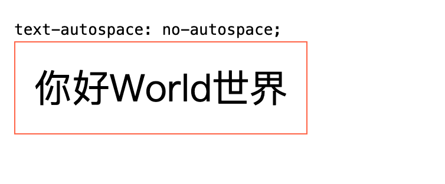

相关文档：

[text-autospace - CSS：层叠样式表 | MDN](https://developer.mozilla.org/zh-CN/docs/Web/CSS/Reference/Properties/text-autospace)

["text-autospace" | Can I use... Support tables for HTML5, CSS3, etc](https://caniuse.com/?search=text-autospace)

**Baseline** 2025 支持 Chrome 140+

---

## Introduction

此功能可以用以实现中英文混排中的间距控制

```css
text-autospace: normal;
```

使用：

```css
:root {
  /* 启用自动混排间距 */
  text-autospace: normal;
}

/* 兼容性判断 */
@supports (text-autospace: normal) {
  :root {
    text-autospace: normal;
  }
}
```

> 其实这边的兼容性判断可以不用的，因为旧浏览器会自动忽略这个属性
> 

## Example



`text-autospace: no-autospace;`


`text-autospace: normal;`

- `normal`：创建默认行为，自动在 CJK 字符与非 CJK 字符之间以及标点符号周围添加间距。此值的效果等同于同时应用 `ideograph-alpha` 和 `ideograph-numeric`。
- `no-autospace`：禁用 CJK 和非 CJK 字符间的自动间距行为。
- `ideograph-alpha`：仅在表意文字（如片假名和汉字）与非表意字母（如拉丁字母）之间添加间距。不会在表意文字与非表意数字之间添加间距。
- `ideograph-numeric`仅在表意文字（如片假名和汉字）与非表意数字（如拉丁数字）之间添加间距。不会在表意文字与非表意字母之间添加间距。
- `punctuation`根据特定语言的排版规范，在标点符号周围添加不可分割的间距。
- `insert`仅当表意文字与非表意文字之间不存在现有空格时，才添加指定的间距。
- `replace`将表意文字与非表意文字之间的现有间距（例如 [U+0020](https://developer.mozilla.org/zh-CN/docs/Glossary/Whitespace)）替换为指定的间距。
- `auto`允许浏览器选择符合排版规范的间距。不同浏览器和平台间的间距可能存在差异。

或许你看着上面的 `repalce` 和`insert` 更好用，因为实际上不少人（特别是像我们这样的开发者）现在都已经习惯在中英文之间加上一个空格了（甚至微信输入法有这个自动加空格的功能），所以这个属性显然更友好（因为能同时兼顾不同书写风格群体）

但是！

挺遗憾的，目前为止（December 24, 2025），只有 Firefox 支持了`insert` ，而`replace` 目前就是 0 支持。

---

## 使用场景的一点想法？

其实主要并不知道是否是准确的，但是自己是这样想的：

在展示文本等等的大部分场景中，这个`text-autospace: normal;` 开起来确实是能提高整段话的顺眼程度，但是在**编辑**的场景中，我个人倒是认为这个不能开，因为会误判——「这边是不是误打个空格？」

不过这边也有一个可以说的，这个间距实际控制得很微妙，其实产生这个误判其实也不是很明显。比如你就回到刚刚上面的那个对比图，怎么说？

---

反正自己的东西也是放在，这种很稀碎的文章，我之后也放进来吧。并打上标签 `TIL` (Today I Learned)。

另，本次更新我也顺便把你现在看到的博客整体布局的 `body` 标签里加上了 `text-autospace: normal;`，所以你现在看到的博客正文也是开启了这个属性的。