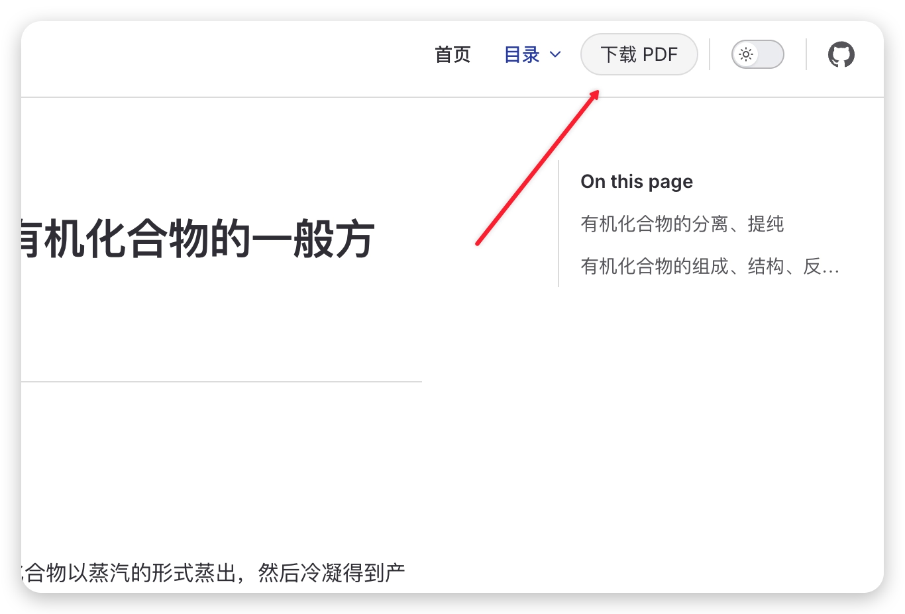
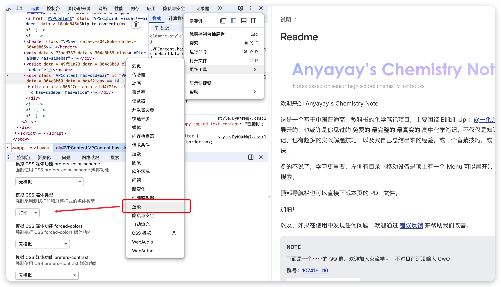

我有另一个关于 [化学笔记的项目](https://github.com/Seeridia/Chemistry-Note)，它使用 VitePress 构建文档站点。

但其实这个项目面向的是高中生，他们更习惯于离线阅读资料（没得手机）。在笔者自己高中的时候，这个就是自己手动去一个个用 Typora 导出 PDF，然后再打包发给同学。一来是麻烦，二来是没办法及时更新。

现在最近也闲了，也发现当时的这个项目现在看的人突然多了起来，所以一方面用 VitePress 构建文档站点，另一方面也想给用户提供一个下载 PDF 的方式。(其实也不仅局限于 vitepress)



所以我想着去彻底解决这个问题——实现在每次我更新文档站点的时候，顺便也能生成一个 PDF 版本的文档的自动化流程。

## 总体思路

思路其实很简单，VitePress 本身虽然并不支持直接导出 PDF，但是其构建产物不就是 HTML 页面吗？那我们完全可以使用一个工具，把这些 HTML 页面转换成 PDF。

关于 PDF 的问题解决了，另一个就是关于下载的问题。由于用户主要都是国内的高中生，速度需要有保证，所以我选择把生成的 PDF 文件放在 [cnb.cool](https://cnb.cool/) 上面，这样用户可以直接通过 cnb 提供的文件下载链接来下载最新的 PDF 文件。

（实际上是看了一些软件的镜像下载就放在 cnb 上，看着挺不错的，也就这样用了）

## 清理页面样式

首先是清理一下页面媒体查询在打印时的表现。

媒体查询这个大家都蛮熟的了，这边放上一个调试方式（噗嗤，以前我还真是傻傻的去 Ctrl + P 预览打印效果，后来才知道有这个东西）。



好在 VitePress 本身也蛮打印友好的，稍微调整了一下隐藏一些不必要的元素（比如导航栏、侧边栏、页脚等）就好了。对我来说需求就这些，其实也可以在页脚加上一些只在打印时候显示的信息，比如版权页面等，都可以用媒体查询来实现。

## 判断需要导出的页面

其实主要是没法每次都全量导出所有页面的 PDF，毕竟文档站点页面多了之后，生成 PDF 的时间会很长。所以我就想着能不能只导出改动过的页面。

下面直接贴代码，主要就是用 git diff 来判断哪些页面改动了，然后只导出这些页面。

同时也对一些“全局变更”做了判断，比如说侧边栏配置、主题配置、公共资源等，只要这些变更了，就直接全量导出 PDF。

```javascript
// scripts/changed-pages.js

import { execFileSync } from 'child_process'
import fs from 'fs'
import path from 'path'
import url from 'url'

const __dirname = path.dirname(url.fileURLToPath(import.meta.url))

const args = process.argv.slice(2)
const getArgValue = (flag) => {
    const index = args.indexOf(flag)
    if (index === -1) {
        return null
    }
    return args[index + 1] || null
}

const base = getArgValue('--base') || process.env.GIT_BASE
const head = getArgValue('--head') || process.env.GIT_HEAD || 'HEAD'
const outDirInput = getArgValue('--out-dir')
const outDir = outDirInput
    ? path.resolve(process.cwd(), outDirInput)
    : path.resolve(__dirname, '../.github/changed-pages')

// 全 0 的 SHA 表示“无基准”，需要全量导出
const zeroSha = /^0+$/
// 判断是否属于需要全量导出的“全局变更”
const isGlobalChange = (filePath) => {
    if (!filePath) {
        return false
    }
    const normalized = filePath.replace(/\\/g, '/')
    // 如果是下面这些路径的变更，则直接视为全局变更
    return (
        normalized.startsWith('.vitepress/') ||
        normalized.startsWith('public/') ||
        normalized.startsWith('data/') ||
        normalized === 'package.json' ||
        normalized === 'package-lock.json' ||
        normalized === 'bun.lock'
    )
}

// 将 .md 路径映射为站点输出的 .html 路径
const mdToHtml = (filePath) => {
    if (!filePath) {
        return null
    }
    const normalized = filePath.replace(/\\/g, '/')
    if (!/\.md$/i.test(normalized)) {
        return null
    }
    const dir = path.posix.dirname(normalized)
    const baseName = path.posix.basename(normalized)
    const lower = baseName.toLowerCase()
    const targetName =
        lower === 'readme.md' || lower === 'index.md'
            ? 'index.html'
            : baseName.replace(/\.md$/i, '.html')
    return dir === '.' ? targetName : `${dir}/${targetName}`
}

const outputs = {
    forceAll: false,       // 是否需要全量导出
    changed: new Set(),    // 变更的页面列表
    deleted: new Set()     // 删除的页面列表
}

// base 不存在或是全 0，则直接全量
if (!base || zeroSha.test(base)) {
    outputs.forceAll = true
} else {
    let diffOutput = ''
    try {
        // 使用 git diff 获取变更文件列表（含重命名）
        diffOutput = execFileSync('git', ['diff', '--name-status', '-z', `${base}..${head}`], {
            encoding: 'utf8'
        }).trim()
    } catch (error) {
        // 失败时兜底为全量
        outputs.forceAll = true
    }

    if (!outputs.forceAll && diffOutput) {
        // -z 模式以 \0 分隔，便于处理包含空格的路径
        const parts = diffOutput.split('\0').filter(Boolean)
        for (let index = 0; index < parts.length; index += 1) {
            const status = parts[index]
            if (!status) {
                continue
            }
            // 处理重命名：Rxxx 旧路径 新路径
            if (status.startsWith('R')) {
                const oldPath = parts[index + 1]
                const newPath = parts[index + 2]
                index += 2
                if (isGlobalChange(oldPath) || isGlobalChange(newPath)) {
                    outputs.forceAll = true
                }
                // 旧路径视为删除，新路径视为新增
                const deleted = mdToHtml(oldPath)
                const added = mdToHtml(newPath)
                if (deleted) {
                    outputs.deleted.add(deleted)
                }
                if (added) {
                    outputs.changed.add(added)
                }
                continue
            }

            const filePath = parts[index + 1]
            index += 1
            if (isGlobalChange(filePath)) {
                outputs.forceAll = true
            }

            // 只跟踪 Markdown 的变更
            const htmlPath = mdToHtml(filePath)
            if (!htmlPath) {
                continue
            }
            if (status === 'D') {
                outputs.deleted.add(htmlPath)
            } else {
                outputs.changed.add(htmlPath)
            }
        }
    }
}

fs.mkdirSync(outDir, { recursive: true })

const changedList = outputs.forceAll ? [] : Array.from(outputs.changed).sort()
const deletedList = Array.from(outputs.deleted).sort()

// 写入结果文件，供后续工作流读取
fs.writeFileSync(path.join(outDir, 'export-all.txt'), outputs.forceAll ? 'true' : 'false')
fs.writeFileSync(path.join(outDir, 'changed-pages.txt'), changedList.join('\n'))
fs.writeFileSync(path.join(outDir, 'deleted-pages.txt'), deletedList.join('\n'))

// 控制台输出简要统计
console.log(
    JSON.stringify({
        forceAll: outputs.forceAll,
        changed: changedList.length,
        deleted: deletedList.length
    })
)
```

## 导出 PDF

这边我使用的是 [Playwright](https://playwright.dev/) 来做这个工作，因为它本身支持无头浏览器操作，并且可以直接导出 PDF。

读取刚刚生成的变更页面列表，然后一个个打开页面，直接调用 `page.pdf()` 方法导出 PDF 即可。唯一注意的是 CJK 字体的问题，需要注入一些字体样式，确保中文能正确显示。（这边在后续的 GitHub Actions 里也需要安装了 Noto Sans CJK 字体）

```javascript
// scripts/export-pdf.js

import { chromium } from 'playwright'
import fg from 'fast-glob'
import http from 'http'
import fs from 'fs'
import path from 'path'
import url from 'url'

const __dirname = path.dirname(url.fileURLToPath(import.meta.url))
const distDir = path.resolve(__dirname, '../.vitepress/dist')

const args = process.argv.slice(2)
const listIndex = args.indexOf('--list')
const outIndex = args.indexOf('--out-dir')
const listPath = listIndex >= 0 ? args[listIndex + 1] : null
const outDirArg = outIndex >= 0 ? args[outIndex + 1] : null
if (listIndex >= 0 && !listPath) {
    throw new Error('Missing value for --list')
}
if (outIndex >= 0 && !outDirArg) {
    throw new Error('Missing value for --out-dir')
}
const outDir = outDirArg
    ? path.resolve(process.cwd(), outDirArg)
    : path.resolve(__dirname, '../pdf')

fs.mkdirSync(outDir, { recursive: true })

const mimeTypes = {
    '.css': 'text/css; charset=utf-8',
    '.gif': 'image/gif',
    '.html': 'text/html; charset=utf-8',
    '.jpeg': 'image/jpeg',
    '.jpg': 'image/jpeg',
    '.js': 'application/javascript; charset=utf-8',
    '.json': 'application/json; charset=utf-8',
    '.png': 'image/png',
    '.svg': 'image/svg+xml',
    '.webp': 'image/webp',
    '.woff': 'font/woff',
    '.woff2': 'font/woff2'
}

// 用本地 HTTP 服务替代 file:// 访问，确保 CSS/JS/图片/字体等资源按正常 URL 规则加载
// 同时避免浏览器对 file:// 的安全限制导致资源无法读取
const server = http.createServer((req, res) => {
    if (!req.url) {
        res.writeHead(400)
        res.end('Bad Request')
        return
    }

    const decodedPath = decodeURIComponent(req.url.split('?')[0])
    const safePath = decodedPath.replace(/^\/+/, '')
    const filePath = path.resolve(distDir, safePath || 'index.html')

    if (!filePath.startsWith(distDir)) {
        res.writeHead(403)
        res.end('Forbidden')
        return
    }

    fs.stat(filePath, (err, stats) => {
        if (err || !stats.isFile()) {
            res.writeHead(404)
            res.end('Not Found')
            return
        }

        const ext = path.extname(filePath).toLowerCase()
        const contentType = mimeTypes[ext] || 'application/octet-stream'
        res.writeHead(200, { 'Content-Type': contentType })
        fs.createReadStream(filePath).pipe(res)
    })
})

let files = []
if (listPath) {
    const raw = fs.readFileSync(listPath, 'utf8')
    files = raw
        .split('\n')
        .map((line) => line.trim())
        .filter((line) => line && line !== '404.html')
    files = Array.from(new Set(files))
    files = files.filter((file) => fs.existsSync(path.join(distDir, file)))
} else {
    files = await fg('**/*.html', {
        cwd: distDir,
        ignore: ['404.html']
    })
}

if (files.length === 0) {
    console.log('No pages to export.')
    process.exit(0)
}

const serverPort = await new Promise((resolve) => {
    server.listen(0, '127.0.0.1', () => resolve(server.address().port))
})

const browser = await chromium.launch()
const page = await browser.newPage()
// 注入字体样式，确保中文能好好显示
await page.addStyleTag({
    content:
        'html, body { font-family: "Noto Sans CJK SC","Noto Sans SC","Source Han Sans SC","Microsoft YaHei","PingFang SC",sans-serif !important; }'
})

for (const file of files) {
    const inputPath = path.join(distDir, file)
    const outputPath = path.join(outDir, file.replace(/\.html$/, '.pdf'))

    fs.mkdirSync(path.dirname(outputPath), { recursive: true })

    const urlPath = encodeURI(file.replace(/\\/g, '/'))
    const fileUrl = `http://127.0.0.1:${serverPort}/${urlPath}`

    console.log('Exporting:', file)

    await page.goto(fileUrl, { waitUntil: 'networkidle' })
    await page.evaluate(() => (document.fonts ? document.fonts.ready : null))

    await page.pdf({
        path: outputPath,
        format: 'A4',
        printBackground: true,
        margin: {
            top: '15mm',
            bottom: '15mm',
            left: '15mm',
            right: '15mm'
        }
    })
}

await browser.close()
await new Promise((resolve) => server.close(resolve))
```

## Github Actions 集成

到这边我个人的方案是：将上一步已经导出的 PDF 文件 push 到一个单独的仓库上，并且我选择放在 cnb 上面，这样国内用户可以直接通过 cnb 提供的文件下载链接来下载最新的 PDF 文件。

```yaml
name: Deploy to Production Server

on:
  push:
    branches:
      - master

jobs:
  build-and-deploy:
    runs-on: ubuntu-latest

    steps:
      # 第一步：迁出代码
      - name: Checkout Code
        uses: actions/checkout@v4
        with:
          fetch-depth: 0

      # 第二步：设置 Bun 环境
      - name: Setup Bun
        uses: oven-sh/setup-bun@v2
        with:
          bun-version: latest

      # 第三步：安装依赖
      - name: Install Dependencies
        run: bun install

      # 第四步：打包项目
      - name: Build Project
        run: bun run docs:build

      # 第五步：检测变更页面
      - name: Detect changed pages
        id: changed_pages
        run: |
          bun scripts/changed-pages.js --base "${{ github.event.before }}" --head "${{ github.sha }}" --out-dir .github/changed-pages
          export_all=$(cat .github/changed-pages/export-all.txt)
          changed_count=$(grep -c . .github/changed-pages/changed-pages.txt || true)
          deleted_count=$(grep -c . .github/changed-pages/deleted-pages.txt || true)
          echo "export_all=$export_all" >> $GITHUB_OUTPUT
          echo "changed_count=$changed_count" >> $GITHUB_OUTPUT
          echo "deleted_count=$deleted_count" >> $GITHUB_OUTPUT

      # 第六步：上传构建产物供 PDF 导出使用
      - name: Upload build artifacts
        uses: actions/upload-artifact@v4
        with:
          name: site-dist
          path: |
            .vitepress/dist
            .github/changed-pages

      # 第七步：部署到服务器（略）

  export-pdfs:
    needs: build-and-deploy
    runs-on: ubuntu-latest

    steps:
      - name: Checkout Code
        uses: actions/checkout@v4
        with:
          fetch-depth: 0

      - name: Download build artifacts
        uses: actions/download-artifact@v4
        with:
          name: site-dist
          path: .

      - name: Setup Bun
        uses: oven-sh/setup-bun@v2
        with:
          bun-version: latest

      - name: Install Dependencies
        run: bun install

      # 需要安装 CJK 字体以确保 PDF 导出时中文显示正确
      - name: Install CJK fonts
        run: |
          sudo apt-get update
          sudo apt-get install -y fonts-noto-cjk

      # 读取变更页面信息
      - name: Read changed pages info
        id: changed_pages
        run: |
          export_all=$(cat .github/changed-pages/export-all.txt 2>/dev/null || echo "false")
          changed_count=$(grep -c . .github/changed-pages/changed-pages.txt 2>/dev/null || true)
          deleted_count=$(grep -c . .github/changed-pages/deleted-pages.txt 2>/dev/null || true)
          echo "export_all=$export_all" >> $GITHUB_OUTPUT
          echo "changed_count=$changed_count" >> $GITHUB_OUTPUT
          echo "deleted_count=$deleted_count" >> $GITHUB_OUTPUT

      # 克隆 PDF 仓库（只需要 clone 1层，不然后面很大）
      - name: Clone CNB PDF Repository
        if: steps.changed_pages.outputs.export_all == 'true' || steps.changed_pages.outputs.changed_count != '0' || steps.changed_pages.outputs.deleted_count != '0'
        run: |
          git clone --depth 1 https://cnb:${{ secrets.CNB_TOKEN }}@cnb.cool/Seeridia/Chemistry-Note-File.git pdf-repo

      - name: Install Playwright Browsers
        if: steps.changed_pages.outputs.export_all == 'true' || steps.changed_pages.outputs.changed_count != '0'
        run: npx playwright install --with-deps chromium

      - name: Export PDFs (all)
        if: steps.changed_pages.outputs.export_all == 'true'
        run: bun scripts/export-pdf.js --out-dir pdf-repo

      - name: Export PDFs (changed)
        if: steps.changed_pages.outputs.export_all != 'true' && steps.changed_pages.outputs.changed_count != '0'
        run: bun scripts/export-pdf.js --list .github/changed-pages/changed-pages.txt --out-dir pdf-repo

      - name: Remove deleted PDFs
        if: steps.changed_pages.outputs.deleted_count != '0'
        run: |
          while IFS= read -r file; do
            [ -z "$file" ] && continue
            pdf="${file%.html}.pdf"
            rm -f "pdf-repo/$pdf"
          done < .github/changed-pages/deleted-pages.txt

      - name: Push PDF updates
        if: steps.changed_pages.outputs.export_all == 'true' || steps.changed_pages.outputs.changed_count != '0' || steps.changed_pages.outputs.deleted_count != '0'
        run: |
          cd pdf-repo
          git config user.name "github-actions[bot]"
          git config user.email "github-actions[bot]@users.noreply.github.com"
          if [ -z "$(git status --porcelain)" ]; then
            echo "No PDF changes to push."
            exit 0
          fi
          git add -A
          git commit -m "Sync PDFs from ${{ github.sha }}"
          git push
```

## vitepress 配合

最后在 VitePress 站点里加一个下载链接就好了，这一部分可以去 [vitepress 官方文档](https://vitepress.dev/zh/reference/default-theme-nav#nav)里看看相关内容

import { Tabs, TabItem } from 'astro-pure/user';

<Tabs>
   <TabItem label="下载组件">
```vue
<script setup lang="ts">
import { computed } from "vue";
import { useData } from "vitepress";

const { page } = useData();

const PDF_BASE_URL =
  "https://cnb.cool/Seeridia/Chemistry-Note-File/-/git/raw/main/";

// 生成当前页面对应的 PDF 下载链接
const pdfUrl = computed(() => {
  const filePath = page.value.filePath ?? "";
  if (!filePath.endsWith(".md")) return "";
  const pdfPath = filePath.replace(/\.md$/i, ".pdf");
  return `${PDF_BASE_URL}${encodeURI(pdfPath)}?download=true`;
});

// 只有在文档页面才显示下载 PDF 按钮
const isDocPage = computed(
  () => (page.value.frontmatter?.layout ?? "doc") === "doc",
);
const shouldShow = computed(() => isDocPage.value && pdfUrl.value);

</script>

<template>
  <div class="CCPdfDownloadButton">
    <a
      v-if="shouldShow"
      class="CCPdfDownloadButtonBtn"
      :href="pdfUrl"
      target="_blank"
      rel="noopener"
    >
      下载 PDF
    </a>
  </div>
</template>

<style scoped>
.CCPdfDownloadButton {
  display: flex;
  align-items: center;
}

.CCPdfDownloadButtonBtn {
  padding: 8px 14px;
  border-radius: 999px;
  border: 1px solid var(--vp-c-divider);
  background: var(--vp-c-bg-soft);
  color: var(--vp-c-text-1);
  font-size: 14px;
  line-height: 1;
  transition:
    border-color 0.25s,
    background-color 0.25s,
    color 0.25s;
  cursor: pointer;
}

.CCPdfDownloadButtonBtn:hover {
  border-color: var(--vp-c-brand-1);
  background: var(--vp-c-bg-soft-hover);
  color: var(--vp-c-brand-1);
}
</style>
```
   </TabItem>
   <TabItem label="组件注册">
```ts
// .vitepress/theme/index.ts

import DefaultTheme from "vitepress/theme";
import type { App } from "vue";
import layout from "./layout.vue";
import "./custom.css";

import CCPdfDownloadButton from "./components/CCPdfDownloadButton.vue";

export default {
  extends: DefaultTheme,
  Layout: layout,
  enhanceApp({ app }: { app: App }) {
    app.component("CCPdfDownloadButton", CCPdfDownloadButton);
  },
};
```
   </TabItem>
</Tabs>

另外导航栏这边的组件只能在桌面端显示，移动端是放在二级菜单里面，我个人是多处理了一个用插槽来实现移动端显示下载按钮

```vue
<script setup>
import DefaultTheme from "vitepress/theme";
import PdfDownloadButton from "./components/CCPdfDownloadButton.vue";

const { Layout } = DefaultTheme;
</script>

<template>
  <Layout>
    <!-- 只有在移动端显示该 PDF 下载按钮，桌面端的按钮在了导航栏里 -->
    <template #nav-bar-content-before>
      <div class="PdfDownloadButton">
        <PdfDownloadButton />
      </div>
    </template>
  </Layout>
</template>

<style scoped>
.PdfDownloadButton {
  display: none;
}

@media (max-width: 768px) {
  .PdfDownloadButton {
    display: block;
  }
}
</style>
```

到此，我们实现了

1. PDF 自动构建，实时更新
2. 在 VitePress 站点提供下载链接

具体的实现可以看看原项目

import { GithubCard } from 'astro-pure/advanced'

<GithubCard repo='Seeridia/Chemistry-note' />